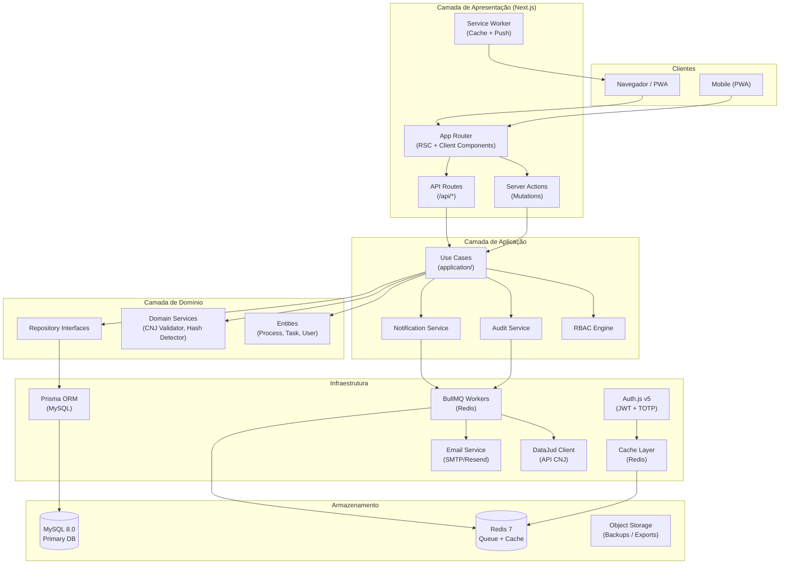
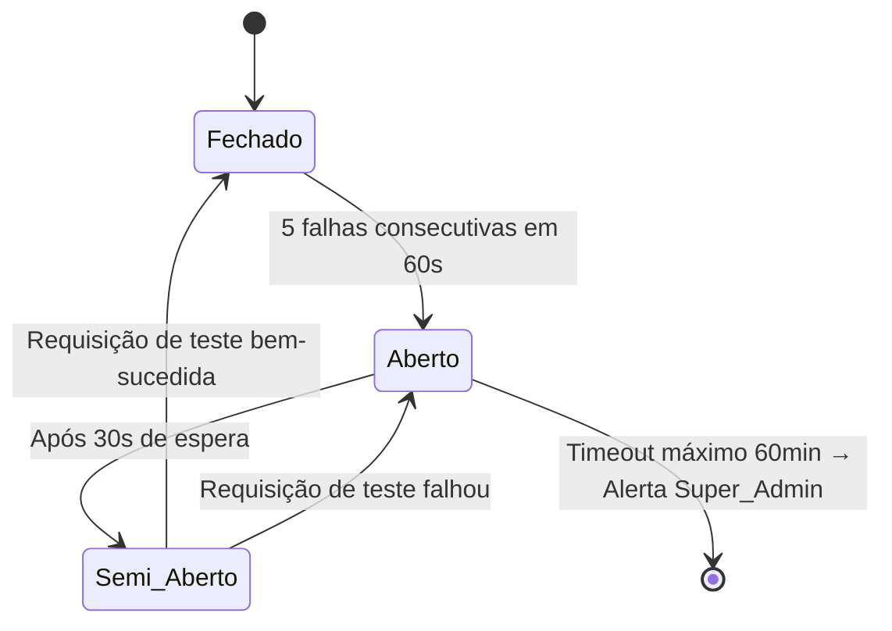
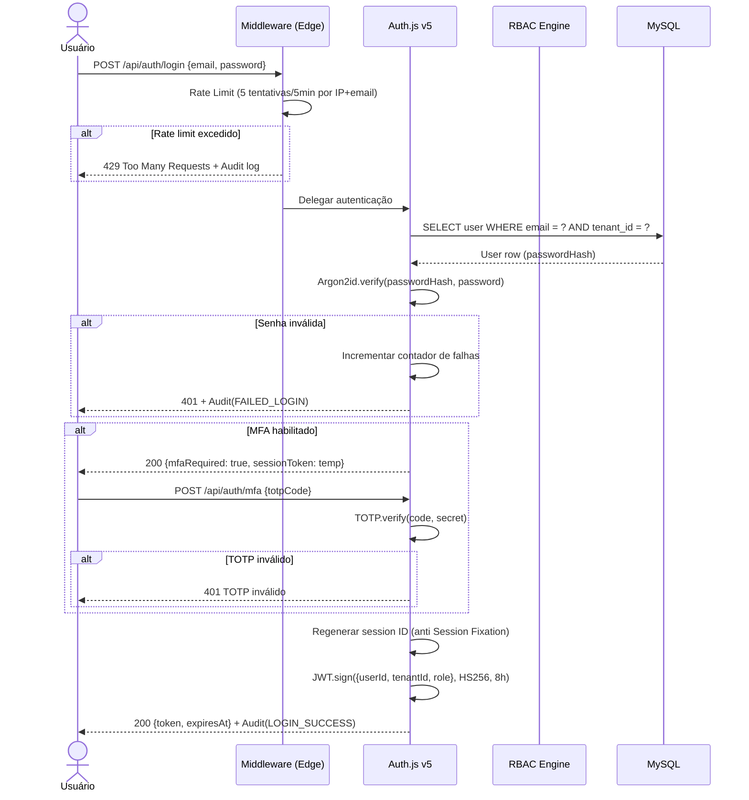
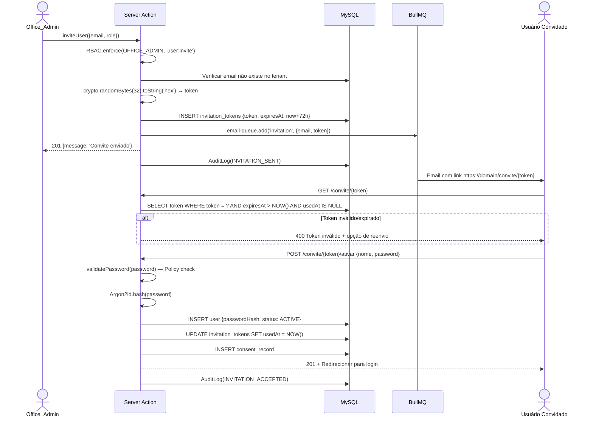
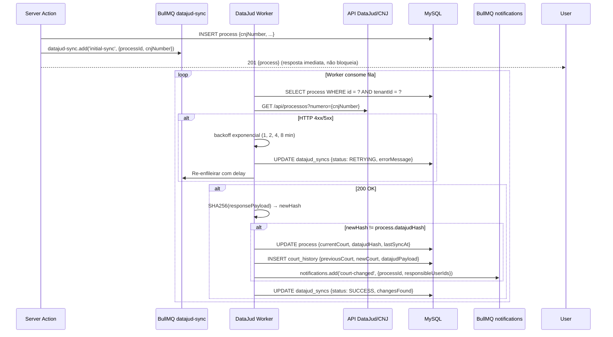
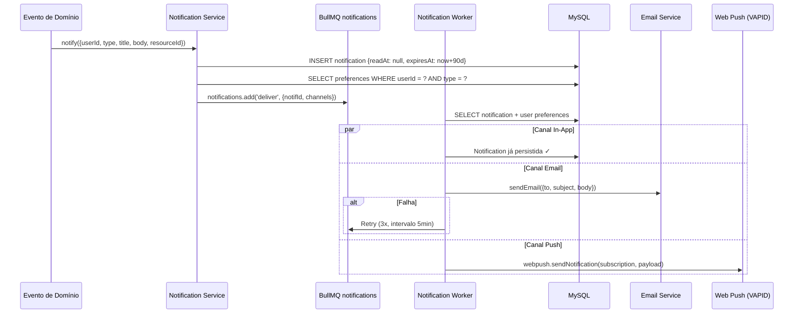
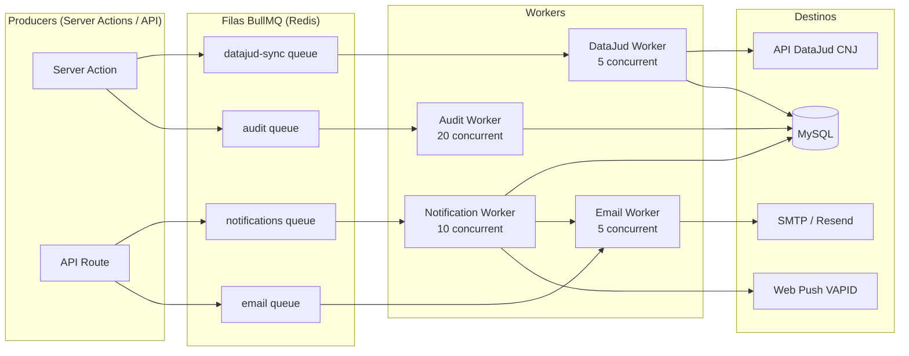
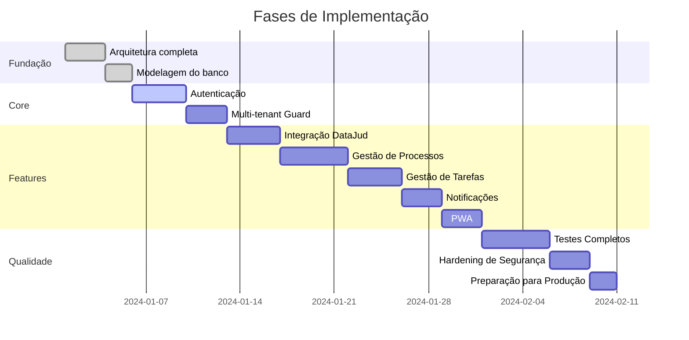

# Design Document — Plataforma Jurídica SaaS Multi-Tenant

## Overview

A **Plataforma Jurídica SaaS Multi-Tenant** é um sistema de nível corporativo construído sobre Next.js 14 (App Router) com arquitetura em camadas inspirada em Domain-Driven Design (DDD). O sistema centraliza a gestão de processos judiciais, tarefas, usuários e comunicações para centenas de escritórios de advocacia simultâneos, integrando-se ao DataJud/CNJ para sincronização automática de dados processuais.

### Princípios Arquiteturais

- **Isolamento por Tenant**: Todo dado possui `tenant_id` imutável; toda query filtra por ele
- **Segurança por Padrão**: Rate limiting, RBAC, auditoria e criptografia em todas as camadas
- **Operações Assíncronas**: Integrações externas e notificações via BullMQ — nunca bloqueiam o usuário
- **Imutabilidade de Trilhas**: Auditoria e histórico de tribunais são append-only
- **Observabilidade Completa**: Logs JSON estruturados em todas as operações relevantes

### Stack Obrigatória

| Camada | Tecnologia |
|---|---|
| Frontend | Next.js 14 (App Router), React 18, TypeScript, Shadcn/UI, Tailwind CSS |
| Autenticação | Auth.js v5 (NextAuth), JWT HS256, TOTP (RFC 6238) |
| Banco de Dados | MySQL 8.0+, Prisma ORM 5.x |
| Validação | Zod 3.x |
| Filas | BullMQ 5.x + Redis 7.x |
| Testes | Vitest 1.x, Playwright, Testing Library, fast-check (PBT) |
| PWA | next-pwa, Web Push API (VAPID) |
| Segurança | Argon2id, AES-256-GCM, CSRF tokens |

---

## Architecture

### Diagrama de Alto Nível



### Padrões Arquiteturais

| Padrão | Aplicação |
|---|---|
| **DDD (Domain-Driven Design)** | Entidades de domínio ricas, Value Objects para CNJ_Number e Status |
| **Repository Pattern** | Interfaces na camada `domain/`, implementações em `infrastructure/` |
| **CQRS (leve)** | Server Actions para mutations; RSC + queries diretas para reads |
| **Event-Driven (filas)** | Eventos assíncronos via BullMQ: DataJud, notificações, auditoria |
| **Tenant Isolation** | Middleware de validação de `tenant_id` em cada requisição autenticada |
| **Defense in Depth** | Rate limiting → Autenticação → RBAC → Validação → Sanitização → Auditoria |

---

## Components and Interfaces

### Estrutura de Pastas Completa

```
sistema-juridico/
├── src/
│   ├── app/                          # Next.js App Router
│   │   ├── (auth)/                   # Grupo de rotas públicas
│   │   │   ├── login/
│   │   │   ├── convite/[token]/
│   │   │   └── mfa/
│   │   ├── (platform)/               # Rotas autenticadas
│   │   │   ├── dashboard/
│   │   │   ├── processos/
│   │   │   │   ├── page.tsx
│   │   │   │   ├── [id]/
│   │   │   │   └── novo/
│   │   │   ├── tarefas/
│   │   │   ├── configuracoes/
│   │   │   └── notificacoes/
│   │   ├── admin/                    # Painel Super_Admin
│   │   ├── api/
│   │   │   ├── auth/[...nextauth]/
│   │   │   ├── health/
│   │   │   ├── processos/
│   │   │   ├── tarefas/
│   │   │   ├── usuarios/
│   │   │   ├── notificacoes/
│   │   │   └── webhooks/
│   │   ├── layout.tsx
│   │   └── globals.css
│   │
│   ├── modules/                      # Módulos de funcionalidade
│   │   ├── auth/
│   │   │   ├── actions/              # Server Actions de autenticação
│   │   │   ├── components/           # Formulários de login, MFA
│   │   │   └── hooks/
│   │   ├── processos/
│   │   │   ├── actions/
│   │   │   ├── components/
│   │   │   └── hooks/
│   │   ├── tarefas/
│   │   │   ├── actions/
│   │   │   ├── components/           # Kanban Board
│   │   │   └── hooks/
│   │   ├── usuarios/
│   │   ├── notificacoes/
│   │   ├── admin/
│   │   └── lgpd/
│   │
│   ├── domain/                       # Regras de negócio puras
│   │   ├── entities/
│   │   │   ├── Process.ts
│   │   │   ├── Task.ts
│   │   │   ├── User.ts
│   │   │   ├── Tenant.ts
│   │   │   └── AuditLog.ts
│   │   ├── value-objects/
│   │   │   ├── CnjNumber.ts          # Validação CNJ encapsulada
│   │   │   ├── TenantId.ts
│   │   │   └── TaskStatus.ts
│   │   ├── services/
│   │   │   ├── HashDetector.ts       # SHA-256 diff de payloads DataJud
│   │   │   ├── RBACEngine.ts         # Avaliação de permissões
│   │   │   ├── TokenGenerator.ts     # Geração de Invitation_Tokens
│   │   │   └── PermissionMatrix.ts   # Matriz de permissões por papel
│   │   └── repositories/             # Interfaces (contratos)
│   │       ├── IProcessRepository.ts
│   │       ├── ITaskRepository.ts
│   │       ├── IUserRepository.ts
│   │       └── IAuditRepository.ts
│   │
│   ├── application/                  # Casos de uso
│   │   ├── processos/
│   │   │   ├── CreateProcessUseCase.ts
│   │   │   ├── UpdateProcessUseCase.ts
│   │   │   ├── ListProcessesUseCase.ts
│   │   │   └── SyncDataJudUseCase.ts
│   │   ├── tarefas/
│   │   │   ├── CreateTaskUseCase.ts
│   │   │   └── MoveTaskStatusUseCase.ts
│   │   ├── usuarios/
│   │   │   ├── InviteUserUseCase.ts
│   │   │   ├── ActivateUserUseCase.ts
│   │   │   └── DeactivateUserUseCase.ts
│   │   ├── auth/
│   │   │   ├── AuthenticateUseCase.ts
│   │   │   └── SetupMFAUseCase.ts
│   │   └── notificacoes/
│   │       └── SendNotificationUseCase.ts
│   │
│   ├── infrastructure/               # Implementações concretas
│   │   ├── database/
│   │   │   ├── prisma/
│   │   │   │   ├── schema.prisma
│   │   │   │   ├── migrations/
│   │   │   │   └── seed.ts
│   │   │   └── repositories/         # Implementações Prisma
│   │   ├── queues/
│   │   │   ├── workers/
│   │   │   │   ├── datajudSyncWorker.ts
│   │   │   │   ├── notificationWorker.ts
│   │   │   │   ├── auditWorker.ts
│   │   │   │   └── emailWorker.ts
│   │   │   ├── producers/
│   │   │   └── queues.ts             # Definições das filas BullMQ
│   │   ├── email/
│   │   │   ├── EmailService.ts
│   │   │   └── templates/
│   │   ├── datajud/
│   │   │   ├── DataJudClient.ts
│   │   │   └── schemas/              # Zod schemas de validação
│   │   ├── cache/
│   │   │   └── RedisCache.ts
│   │   └── security/
│   │       ├── Argon2Hash.ts
│   │       ├── AESEncryption.ts
│   │       ├── RateLimiter.ts
│   │       └── CSRFProtection.ts
│   │
│   └── shared/                       # Utilitários compartilhados
│       ├── types/
│       ├── errors/
│       │   ├── AppError.ts
│       │   ├── AuthError.ts
│       │   ├── ForbiddenError.ts
│       │   └── ValidationError.ts
│       ├── logger/
│       │   └── logger.ts             # JSON structured logging
│       ├── middleware/
│       │   ├── tenantGuard.ts
│       │   ├── rateLimitMiddleware.ts
│       │   └── securityHeaders.ts
│       └── utils/
│           ├── pagination.ts
│           └── crypto.ts
│
├── project-context/                  # Documentação de continuidade
│   ├── architecture.md
│   ├── database.md
│   ├── api-contracts.md
│   ├── progress.md
│   ├── decisions.md
│   └── checkpoint.json
│
├── tests/
│   ├── unit/
│   ├── integration/
│   ├── e2e/                          # Playwright
│   └── property/                     # fast-check PBT
│
├── public/
│   ├── manifest.json                 # PWA Manifest
│   ├── sw.js                         # Service Worker
│   └── icons/
│
├── middleware.ts                     # Next.js Edge Middleware
├── next.config.mjs
├── prisma/                           # Symlink ou alias para src/infrastructure/database/prisma
└── package.json
```

### Interfaces Principais

#### RBAC Engine

```typescript
// src/domain/services/RBACEngine.ts
export type Role = 'SUPER_ADMIN' | 'OFFICE_ADMIN' | 'LAWYER' | 'LEGAL_ASSISTANT' | 'INTERN' | 'READ_ONLY_USER';

export type Action = 
  | 'process:read' | 'process:create' | 'process:update' | 'process:delete'
  | 'task:read' | 'task:create' | 'task:update' | 'task:delete'
  | 'user:invite' | 'user:deactivate' | 'user:role:change'
  | 'audit:read' | 'tenant:manage';

export interface RBACContext {
  userId: string;
  tenantId: string;
  role: Role;
  resourceTenantId: string;
}

export interface IRBACEngine {
  can(context: RBACContext, action: Action): boolean;
  enforce(context: RBACContext, action: Action): void; // throws ForbiddenError
}
```

#### Repository Pattern

```typescript
// src/domain/repositories/IProcessRepository.ts
export interface IProcessRepository {
  findById(id: string, tenantId: string): Promise<Process | null>;
  findMany(filters: ProcessFilters, tenantId: string): Promise<PaginatedResult<Process>>;
  create(data: CreateProcessData, tenantId: string): Promise<Process>;
  update(id: string, data: UpdateProcessData, tenantId: string): Promise<Process>;
  softDelete(id: string, tenantId: string): Promise<void>;
}
// INVARIANTE: todo método SEMPRE recebe tenantId e o aplica como filtro obrigatório
```

#### Audit Service Interface

```typescript
// src/domain/services/AuditService.ts
export interface AuditEvent {
  tenantId: string;
  userId: string | null;
  action: string;
  resourceType: string;
  resourceId: string | null;
  ipAddress: string;
  userAgent: string;
  payloadBefore?: Record<string, unknown>;
  payloadAfter?: Record<string, unknown>;
}

export interface IAuditService {
  // Fire-and-forget: enfileira no BullMQ, não aguarda persistência
  log(event: AuditEvent): void;
}
```

---

## Data Models

### Schema Prisma Completo

```prisma
// src/infrastructure/database/prisma/schema.prisma
generator client {
  provider = "prisma-client-js"
}

datasource db {
  provider = "mysql"
  url      = env("DATABASE_URL")
}

// ─────────────────────────────────────────────────────────────────
// TENANT
// ─────────────────────────────────────────────────────────────────
model Tenant {
  id          String       @id @default(cuid())
  name        String       @db.VarChar(255)
  slug        String       @unique @db.VarChar(100)
  plan        TenantPlan   @default(BASIC)
  status      TenantStatus @default(ACTIVE)
  settings    Json?
  createdAt   DateTime     @default(now()) @map("created_at")
  updatedAt   DateTime     @updatedAt @map("updated_at")

  users       User[]
  processes   Process[]
  tasks       Task[]
  auditLogs   AuditLog[]
  invitations InvitationToken[]
  consents    ConsentRecord[]
  notifications Notification[]

  @@map("tenants")
}

enum TenantPlan   { BASIC PROFESSIONAL ENTERPRISE }
enum TenantStatus { ACTIVE BLOCKED SUSPENDED TERMINATED }

// ─────────────────────────────────────────────────────────────────
// USER
// ─────────────────────────────────────────────────────────────────
model User {
  id              String    @id @default(cuid())
  tenantId        String    @map("tenant_id")
  email           String    @db.VarChar(255)
  name            String    @db.VarChar(255)
  passwordHash    String    @map("password_hash") @db.VarChar(255)
  role            UserRole  @default(READ_ONLY_USER)
  status          UserStatus @default(ACTIVE)
  mfaEnabled      Boolean   @default(false) @map("mfa_enabled")
  mfaSecret       String?   @map("mfa_secret") @db.VarChar(500) // AES-256 encrypted
  lastLoginAt     DateTime? @map("last_login_at")
  createdAt       DateTime  @default(now()) @map("created_at")
  updatedAt       DateTime  @updatedAt @map("updated_at")
  deletedAt       DateTime? @map("deleted_at")

  tenant          Tenant    @relation(fields: [tenantId], references: [id])
  auditLogs       AuditLog[]
  tasks           Task[]    @relation("TaskAssignee")
  createdTasks    Task[]    @relation("TaskCreator")
  taskHistory     TaskHistory[]
  invitedBy       InvitationToken[] @relation("InvitedBy")
  notifications   UserNotificationPreference[]
  consents        ConsentRecord[]
  courtChanges    CourtHistory[]

  @@unique([email, tenantId])
  @@index([tenantId])
  @@index([email])
  @@index([tenantId, status])
  @@map("users")
}

enum UserRole   { SUPER_ADMIN OFFICE_ADMIN LAWYER LEGAL_ASSISTANT INTERN READ_ONLY_USER }
enum UserStatus { ACTIVE INACTIVE PENDING }
```

```prisma
// ─────────────────────────────────────────────────────────────────
// PROCESS
// ─────────────────────────────────────────────────────────────────
model Process {
  id                  String        @id @default(cuid())
  tenantId            String        @map("tenant_id")
  cnjNumber           String        @map("cnj_number") @db.VarChar(25)
  clientName          String        @map("client_name") @db.VarChar(255)
  currentCourt        String?       @map("current_court") @db.VarChar(500)
  status              ProcessStatus @default(ACTIVE)
  processClass        String        @map("process_class") @db.VarChar(255)
  subject             String        @db.VarChar(500)
  description         String?       @db.Text
  tags                Json?         // string[]
  responsibleUserIds  Json          @map("responsible_user_ids") // string[]
  lastDatajudSyncAt   DateTime?     @map("last_datajud_sync_at")
  datajudHash         String?       @map("datajud_hash") @db.VarChar(64)
  createdAt           DateTime      @default(now()) @map("created_at")
  updatedAt           DateTime      @updatedAt @map("updated_at")
  deletedAt           DateTime?     @map("deleted_at")

  tenant              Tenant        @relation(fields: [tenantId], references: [id])
  tasks               Task[]
  courtHistory        CourtHistory[]
  datajudSyncs        DataJudSync[]

  @@unique([cnjNumber, tenantId])
  @@index([tenantId])
  @@index([tenantId, status])
  @@index([tenantId, cnjNumber])
  @@map("processes")
}

enum ProcessStatus { ACTIVE ARCHIVED DELETED }

// ─────────────────────────────────────────────────────────────────
// COURT HISTORY — IMUTÁVEL (append-only)
// ─────────────────────────────────────────────────────────────────
model CourtHistory {
  id                String   @id @default(cuid())
  processId         String   @map("process_id")
  tenantId          String   @map("tenant_id")
  previousCourt     String?  @map("previous_court") @db.VarChar(500)
  newCourt          String   @map("new_court") @db.VarChar(500)
  changedAt         DateTime @default(now()) @map("changed_at")
  changeReason      String?  @map("change_reason") @db.VarChar(1000)
  changedByUserId   String?  @map("changed_by_user_id")
  datajudPayload    Json?    @map("datajud_payload")

  process           Process  @relation(fields: [processId], references: [id])
  changedByUser     User?    @relation(fields: [changedByUserId], references: [id])

  @@index([processId])
  @@index([tenantId])
  @@index([changedAt])
  @@map("court_history")
}

// ─────────────────────────────────────────────────────────────────
// TASK
// ─────────────────────────────────────────────────────────────────
model Task {
  id              String       @id @default(cuid())
  tenantId        String       @map("tenant_id")
  processId       String?      @map("process_id")
  title           String       @db.VarChar(500)
  description     String?      @db.Text
  priority        TaskPriority @default(MEDIUM)
  assigneeUserId  String?      @map("assignee_user_id")
  dueDate         DateTime?    @map("due_date")
  status          TaskStatus   @default(TODO)
  createdByUserId String       @map("created_by_user_id")
  createdAt       DateTime     @default(now()) @map("created_at")
  updatedAt       DateTime     @updatedAt @map("updated_at")
  deletedAt       DateTime?    @map("deleted_at")

  tenant          Tenant       @relation(fields: [tenantId], references: [id])
  process         Process?     @relation(fields: [processId], references: [id])
  assignee        User?        @relation("TaskAssignee", fields: [assigneeUserId], references: [id])
  createdBy       User         @relation("TaskCreator", fields: [createdByUserId], references: [id])
  history         TaskHistory[]

  @@index([tenantId])
  @@index([tenantId, status])
  @@index([tenantId, assigneeUserId])
  @@index([tenantId, dueDate])
  @@map("tasks")
}

enum TaskPriority { LOW MEDIUM HIGH URGENT }
enum TaskStatus   { TODO IN_PROGRESS REVIEW DONE }

// ─────────────────────────────────────────────────────────────────
// TASK HISTORY — IMUTÁVEL (append-only)
// ─────────────────────────────────────────────────────────────────
model TaskHistory {
  id            String     @id @default(cuid())
  taskId        String     @map("task_id")
  fromStatus    TaskStatus @map("from_status")
  toStatus      TaskStatus @map("to_status")
  movedByUserId String     @map("moved_by_user_id")
  movedAt       DateTime   @default(now()) @map("moved_at")

  task          Task       @relation(fields: [taskId], references: [id])
  movedBy       User       @relation(fields: [movedByUserId], references: [id])

  @@index([taskId])
  @@map("task_history")
}
```

```prisma
// ─────────────────────────────────────────────────────────────────
// AUDIT LOG — IMUTÁVEL (append-only)
// ─────────────────────────────────────────────────────────────────
model AuditLog {
  id            String   @id @default(cuid())
  tenantId      String?  @map("tenant_id")
  userId        String?  @map("user_id")
  action        String   @db.VarChar(100)
  resourceType  String   @map("resource_type") @db.VarChar(100)
  resourceId    String?  @map("resource_id") @db.VarChar(255)
  timestamp     DateTime @default(now())
  ipAddress     String   @map("ip_address") @db.VarChar(45)
  userAgent     String   @map("user_agent") @db.VarChar(1000)
  payloadBefore Json?    @map("payload_before")
  payloadAfter  Json?    @map("payload_after")
  payloadHash   String   @map("payload_hash") @db.VarChar(64) // SHA-256 para verificação de integridade

  tenant        Tenant?  @relation(fields: [tenantId], references: [id])
  user          User?    @relation(fields: [userId], references: [id])

  @@index([tenantId])
  @@index([tenantId, userId])
  @@index([tenantId, action])
  @@index([timestamp])
  @@map("audit_logs")
}

// ─────────────────────────────────────────────────────────────────
// NOTIFICATION
// ─────────────────────────────────────────────────────────────────
model Notification {
  id           String             @id @default(cuid())
  tenantId     String             @map("tenant_id")
  userId       String             @map("user_id")
  type         NotificationType
  title        String             @db.VarChar(500)
  body         String             @db.Text
  resourceType String?            @map("resource_type") @db.VarChar(100)
  resourceId   String?            @map("resource_id") @db.VarChar(255)
  readAt       DateTime?          @map("read_at")
  createdAt    DateTime           @default(now()) @map("created_at")
  expiresAt    DateTime           @map("expires_at") // 90 dias após criação

  tenant       Tenant             @relation(fields: [tenantId], references: [id])

  @@index([tenantId, userId])
  @@index([tenantId, userId, readAt])
  @@index([expiresAt])
  @@map("notifications")
}

enum NotificationType {
  PROCESS_UPDATED
  COURT_CHANGED
  TASK_ASSIGNED
  TASK_COMPLETED
  INVITATION_SENT
  INVITATION_ACCEPTED
  ACCOUNT_BLOCKED
  DATAJUD_UNAVAILABLE
  SYSTEM_ALERT
}

// ─────────────────────────────────────────────────────────────────
// USER NOTIFICATION PREFERENCE
// ─────────────────────────────────────────────────────────────────
model UserNotificationPreference {
  id               String           @id @default(cuid())
  userId           String           @map("user_id")
  tenantId         String           @map("tenant_id")
  notificationType NotificationType @map("notification_type")
  channelInApp     Boolean          @default(true) @map("channel_in_app")
  channelEmail     Boolean          @default(true) @map("channel_email")
  channelPush      Boolean          @default(true) @map("channel_push")
  updatedAt        DateTime         @updatedAt @map("updated_at")

  user             User             @relation(fields: [userId], references: [id])

  @@unique([userId, notificationType])
  @@index([tenantId])
  @@map("user_notification_preferences")
}

// ─────────────────────────────────────────────────────────────────
// INVITATION TOKEN
// ─────────────────────────────────────────────────────────────────
model InvitationToken {
  id           String    @id @default(cuid())
  tenantId     String    @map("tenant_id")
  email        String    @db.VarChar(255)
  role         UserRole
  token        String    @unique @db.VarChar(255) // Criptograficamente seguro, 32 bytes
  invitedById  String    @map("invited_by_id")
  expiresAt    DateTime  @map("expires_at") // +72h após criação
  usedAt       DateTime? @map("used_at")
  revokedAt    DateTime? @map("revoked_at")
  createdAt    DateTime  @default(now()) @map("created_at")

  tenant       Tenant    @relation(fields: [tenantId], references: [id])
  invitedBy    User      @relation("InvitedBy", fields: [invitedById], references: [id])

  @@index([tenantId])
  @@index([token])
  @@index([expiresAt])
  @@map("invitation_tokens")
}

// ─────────────────────────────────────────────────────────────────
// CONSENT RECORD — LGPD
// ─────────────────────────────────────────────────────────────────
model ConsentRecord {
  id            String   @id @default(cuid())
  userId        String   @map("user_id")
  tenantId      String   @map("tenant_id")
  policyVersion String   @map("policy_version") @db.VarChar(20)
  consentedAt   DateTime @default(now()) @map("consented_at")
  ipAddress     String   @map("ip_address") @db.VarChar(45)
  userAgent     String   @map("user_agent") @db.VarChar(1000)

  user          User     @relation(fields: [userId], references: [id])
  tenant        Tenant   @relation(fields: [tenantId], references: [id])

  @@index([userId])
  @@index([tenantId])
  @@map("consent_records")
}

// ─────────────────────────────────────────────────────────────────
// DATAJUD SYNC — Histórico de sincronizações
// ─────────────────────────────────────────────────────────────────
model DataJudSync {
  id           String          @id @default(cuid())
  processId    String          @map("process_id")
  tenantId     String          @map("tenant_id")
  status       DataJudSyncStatus
  attempt      Int             @default(1)
  requestedAt  DateTime        @default(now()) @map("requested_at")
  completedAt  DateTime?       @map("completed_at")
  errorMessage String?         @map("error_message") @db.Text
  responseHash String?         @map("response_hash") @db.VarChar(64)
  changesFound Boolean?        @map("changes_found")

  process      Process         @relation(fields: [processId], references: [id])

  @@index([processId])
  @@index([tenantId, status])
  @@index([requestedAt])
  @@map("datajud_syncs")
}

enum DataJudSyncStatus { PENDING RUNNING SUCCESS FAILED RETRYING }
```

### Estratégia de Multi-Tenancy

- **Row-Level Security via aplicação**: Toda query Prisma recebe `WHERE tenant_id = :tenantId` obrigatório, aplicado pelos repositórios — nunca diretamente nos controllers
- **Middleware de Guarda**: `tenantGuard.ts` extrai `tenantId` da sessão JWT e injeta no contexto da requisição; qualquer desvio resulta em HTTP 403 + auditoria
- **Índices Compostos**: Todos os índices críticos incluem `tenantId` como primeiro campo para otimizar as queries filtradas por tenant
- **Sem Row Level Security nativo do MySQL**: A garantia é feita na camada de repositório — os testes de propriedade (P1) verificam esse isolamento automaticamente

---

## Correctness Properties

*Uma propriedade é uma característica ou comportamento que deve ser verdadeiro em todas as execuções válidas de um sistema — essencialmente, uma declaração formal sobre o que o sistema deve fazer. Propriedades servem como a ponte entre especificações legíveis por humanos e garantias de corretude verificáveis por máquinas.*

**Reflexão de Redundância (Property Reflection):**
Após análise do prework, as propriedades foram consolidadas para eliminar redundância:
- As propriedades de imutabilidade de AuditLog e CourtHistory foram unificadas em uma única propriedade de "preservação de trilhas imutáveis" (P4)
- A propriedade de tenant_id imutável em Process (Req 1.1 + 6.9) foi absorvida pela propriedade de isolamento de tenant (P1)
- As propriedades de idempotência do Hash_Detector (Req 7.3 e P5) foram combinadas em P5
- Unicidade de token (Req 4.1 e P7) foram consolidadas em P6

### Property 1: Isolamento de Tenant (Invariante)

*Para qualquer* query executada com `tenant_id = A` sobre qualquer coleção (processos, tarefas, usuários, auditoria), todos os registros retornados devem ter `tenant_id = A`. Nenhum registro de outro tenant deve aparecer no resultado, mesmo com dados de múltiplos tenants simultâneos no banco.

**Validates: Requirements 1.7, 1.1, 6.9**

### Property 2: Round-Trip de Serialização de Process (Round-Trip)

*Para qualquer* objeto `Process` válido com todos os campos obrigatórios preenchidos com valores aleatórios, serializá-lo para JSON e desserializá-lo imediatamente deve produzir um objeto equivalente campo a campo ao original. Nenhum campo deve ser perdido, truncado ou corrompido no processo.

**Validates: Requirements 16.6, 6.2, 6.3**

### Property 3: Validação do Formato CNJ_Number (Error Conditions)

*Para qualquer* string que satisfaz o padrão `NNNNNNN-DD.AAAA.J.TT.OOOO` (7 dígitos, hífen, 2 dígitos, ponto, 4 dígitos, ponto, 1 dígito, ponto, 2 dígitos, ponto, 4 dígitos), o validador deve aceitar a entrada. *Para qualquer* string que não satisfaz esse padrão (caractere faltando, extra, ordem errada, delimitador errado), o validador deve rejeitar com erro descritivo.

**Validates: Requirements 6.1, 16.6**

### Property 4: Imutabilidade de Trilhas (Invariante)

*Para qualquer* registro de `AuditLog` ou `CourtHistory` criado, nenhuma operação subsequente de UPDATE ou DELETE deve modificar ou remover o registro. O hash SHA-256 calculado sobre os campos do registro no momento da criação deve ser idêntico ao hash recalculado em qualquer momento posterior. Para processos com N entradas em `CourtHistory`, após qualquer operação sobre o processo, o número de entradas deve ser maior ou igual a N.

**Validates: Requirements 3.4, 8.3, 9.9**

### Property 5: Idempotência do Hash_Detector (Idempotência)

*Para qualquer* payload JSON retornado pelo DataJud, aplicar o `Hash_Detector` duas vezes consecutivas sobre o mesmo payload não modificado deve produzir o mesmo hash SHA-256 nas duas execuções, resultando em "sem mudança detectada" na segunda execução. Para dois payloads distintos (diferença em qualquer campo), o detector deve sempre retornar "mudança detectada".

**Validates: Requirements 7.3, 16.6**

### Property 6: Unicidade de Invitation_Token (Invariante)

*Para qualquer* conjunto de N tokens gerados pelo `TokenGenerator` (N ≥ 10.000), nenhum par de tokens deve ser idêntico. O tamanho do conjunto distinto de tokens deve ser sempre igual a N, garantindo que tokens são criptograficamente únicos e não previsíveis.

**Validates: Requirements 4.1, 16.6**

### Property 7: RBAC — Bloqueio de Elevação de Privilégio (Error Conditions)

*Para qualquer* usuário com papel de hierarquia H tentando atribuir a si mesmo ou a outro usuário um papel com hierarquia H' onde H' ≥ H (mesmo nível ou superior), o `RBAC_Engine` deve rejeitar a operação retornando `false` para `can()` e lançando `ForbiddenError` em `enforce()`, independentemente do método de requisição ou parâmetros de rota utilizados.

Hierarquia: READ_ONLY_USER(1) < INTERN(2) < LEGAL_ASSISTANT(3) < LAWYER(4) < OFFICE_ADMIN(5) < SUPER_ADMIN(6)

**Validates: Requirements 2.8, 16.8**

### Property 8: Validação de Senha (Error Conditions)

*Para qualquer* string de senha, a função validadora deve aceitar exatamente as strings que satisfazem simultaneamente todos os critérios: comprimento ≥ 12, pelo menos uma letra maiúscula, pelo menos uma letra minúscula, pelo menos um dígito numérico e pelo menos um caractere especial. A ausência de qualquer critério deve resultar em rejeição com mensagem descritiva específica para o critério faltante.

**Validates: Requirements 4.5**

### Property 9: Hash de Senha — Round-Trip de Verificação (Round-Trip)

*Para qualquer* string de senha válida, o hash Argon2id gerado deve ser verificável pela função `verify(hash, senha)` retornando `true`, e para qualquer outra senha distinta, `verify(hash, outra_senha)` deve retornar `false`. O texto plano da senha nunca deve ser igual ao hash armazenado.

**Validates: Requirements 4.6, 12.7**

---

## Error Handling

### Hierarquia de Erros de Aplicação

```typescript
// src/shared/errors/AppError.ts
export class AppError extends Error {
  constructor(
    public readonly code: string,
    public readonly message: string,
    public readonly statusCode: number,
    public readonly context?: Record<string, unknown>
  ) { super(message); }
}

export class AuthenticationError extends AppError {
  constructor(msg = 'Credenciais inválidas') {
    super('AUTH_001', msg, 401);
  }
}

export class ForbiddenError extends AppError {
  constructor(action?: string) {
    super('RBAC_001', `Ação não permitida${action ? ': ' + action : ''}`, 403);
  }
}

export class TenantIsolationError extends AppError {
  constructor() {
    super('TENANT_001', 'Acesso a recurso de tenant inválido', 403);
  }
}

export class ValidationError extends AppError {
  constructor(public readonly fields: Record<string, string[]>) {
    super('VAL_001', 'Dados de entrada inválidos', 422, { fields });
  }
}

export class NotFoundError extends AppError {
  constructor(resource: string) {
    super('NOT_FOUND', `${resource} não encontrado`, 404);
  }
}

export class ConflictError extends AppError {
  constructor(message: string) {
    super('CONFLICT', message, 409);
  }
}
```

### Tabela de Códigos de Status

| Código | Classe de Erro | Cenário |
|---|---|---|
| 200 | — | Operação bem-sucedida (GET, PUT, PATCH) |
| 201 | — | Recurso criado (POST) |
| 204 | — | Sem conteúdo (DELETE) |
| 400 | Bad Request | Input malformado (JSON inválido) |
| 401 | AuthenticationError | Token expirado, assinatura inválida |
| 403 | ForbiddenError / TenantIsolationError | RBAC, tenant cruzado |
| 404 | NotFoundError | Recurso não existe no tenant |
| 409 | ConflictError | CNJ duplicado, email duplicado |
| 422 | ValidationError | Campos inválidos (Zod) |
| 429 | RateLimitError | Rate limit excedido |
| 500 | InternalServerError | Erro não tratado |
| 503 | ServiceUnavailableError | DataJud indisponível, DB down |

### Formato de Resposta de Erro

```json
{
  "error": {
    "code": "VAL_001",
    "message": "Dados de entrada inválidos",
    "details": {
      "cnjNumber": ["Formato inválido. Esperado: NNNNNNN-DD.AAAA.J.TT.OOOO"],
      "clientName": ["Campo obrigatório"]
    },
    "requestId": "req_01HXYZ..."
  }
}
```

### Estratégia de Retry e Circuit Breaker



O `DataJudClient` implementa Circuit Breaker com os estados acima. Quando em estado `Aberto`, requisições são rejeitadas imediatamente sem chamar o DataJud, protegendo o sistema de cascata de falhas.

---

## Fluxos do Sistema

### Fluxo de Autenticação



### Fluxo de Convite de Usuário



### Fluxo de Integração DataJud



### Fluxo de Avaliação RBAC

```mermaid
flowchart TD
    REQ[Requisição Autenticada] --> JWT{JWT válido?}
    JWT -- Não --> E401[401 Unauthorized]
    JWT -- Sim --> EXTRACT[Extrair userId, tenantId, role do JWT]
    EXTRACT --> TENANT{tenantId do JWT\n== tenantId do recurso?}
    TENANT -- Não --> E403T[403 TenantIsolationError\n+ Audit Log]
    TENANT -- Sim --> RBAC{RBAC.can(role, action)}
    RBAC -- Não --> E403R[403 ForbiddenError\n+ Audit Log]
    RBAC -- Sim --> RESOURCE{Recurso existe\nno tenant?}
    RESOURCE -- Não --> E404[404 NotFoundError]
    RESOURCE -- Sim --> EXECUTE[Executar Use Case]
    EXECUTE --> AUDIT[AuditLog assíncrono]
    EXECUTE --> RESPONSE[200/201/204]
```

### Fluxo de Notificações



---

## Contratos de API

### Convenções Gerais

- Todas as rotas autenticadas exigem header `Authorization: Bearer <jwt>`
- Todos os bodies são `Content-Type: application/json`
- Paginação via `?page=1&limit=50` (máximo 50 para listas, 100 para auditoria)
- Timestamps em ISO 8601 UTC
- IDs em formato CUID

### Schemas Zod Principais

```typescript
// src/shared/schemas/process.schema.ts
import { z } from 'zod';

const CNJ_PATTERN = /^\d{7}-\d{2}\.\d{4}\.\d\.\d{2}\.\d{4}$/;

export const CreateProcessSchema = z.object({
  cnjNumber: z.string().regex(CNJ_PATTERN, 'Formato inválido: NNNNNNN-DD.AAAA.J.TT.OOOO'),
  clientName: z.string().min(2).max(255),
  processClass: z.string().min(2).max(255),
  subject: z.string().min(2).max(500),
  description: z.string().max(5000).optional(),
  tags: z.array(z.string().max(50)).max(20).optional(),
  responsibleUserIds: z.array(z.string().cuid()).min(1, 'Mínimo 1 responsável'),
});

export const ProcessFiltersSchema = z.object({
  status: z.enum(['ACTIVE', 'ARCHIVED', 'DELETED']).optional(),
  responsibleUserId: z.string().cuid().optional(),
  court: z.string().optional(),
  tags: z.array(z.string()).optional(),
  createdFrom: z.string().datetime().optional(),
  createdTo: z.string().datetime().optional(),
  page: z.coerce.number().int().min(1).default(1),
  limit: z.coerce.number().int().min(1).max(50).default(20),
});

export const CreateTaskSchema = z.object({
  processId: z.string().cuid().optional(),
  title: z.string().min(2).max(500),
  description: z.string().max(5000).optional(),
  priority: z.enum(['LOW', 'MEDIUM', 'HIGH', 'URGENT']),
  assigneeUserId: z.string().cuid().optional(),
  dueDate: z.string().datetime().optional(),
});

export const InviteUserSchema = z.object({
  email: z.string().email().max(255),
  role: z.enum(['LAWYER', 'LEGAL_ASSISTANT', 'INTERN', 'READ_ONLY_USER']),
});

export const ActivateAccountSchema = z.object({
  name: z.string().min(2).max(255),
  password: z.string()
    .min(12, 'Mínimo 12 caracteres')
    .regex(/[A-Z]/, 'Deve conter letra maiúscula')
    .regex(/[a-z]/, 'Deve conter letra minúscula')
    .regex(/\d/, 'Deve conter número')
    .regex(/[^A-Za-z0-9]/, 'Deve conter caractere especial'),
});
```

### Endpoints REST Principais

#### Processos

| Método | Rota | Descrição | Auth | RBAC |
|---|---|---|---|---|
| GET | `/api/processos` | Listar processos paginados | ✓ | process:read |
| POST | `/api/processos` | Criar processo | ✓ | process:create |
| GET | `/api/processos/:id` | Detalhes do processo | ✓ | process:read |
| PATCH | `/api/processos/:id` | Atualizar processo | ✓ | process:update |
| DELETE | `/api/processos/:id` | Exclusão lógica | ✓ | process:delete |
| GET | `/api/processos/:id/historico` | Histórico de tribunais | ✓ | process:read |
| POST | `/api/processos/:id/sync` | Forçar sync DataJud | ✓ | process:update |

#### Tarefas

| Método | Rota | Descrição | Auth | RBAC |
|---|---|---|---|---|
| GET | `/api/tarefas` | Listar tarefas do tenant | ✓ | task:read |
| POST | `/api/tarefas` | Criar tarefa | ✓ | task:create |
| PATCH | `/api/tarefas/:id` | Atualizar tarefa | ✓ | task:update |
| PATCH | `/api/tarefas/:id/status` | Mover status (Kanban) | ✓ | task:update |
| DELETE | `/api/tarefas/:id` | Exclusão lógica | ✓ | task:delete |

#### Usuários e Convites

| Método | Rota | Descrição | Auth | RBAC |
|---|---|---|---|---|
| GET | `/api/usuarios` | Listar usuários do tenant | ✓ | user:read |
| POST | `/api/usuarios/convite` | Criar convite | ✓ | user:invite |
| DELETE | `/api/usuarios/convite/:id` | Revogar convite | ✓ | user:invite |
| PATCH | `/api/usuarios/:id/status` | Ativar/desativar | ✓ | user:deactivate |
| PATCH | `/api/usuarios/:id/papel` | Mudar papel | ✓ | user:role:change |
| POST | `/convite/:token/ativar` | Ativar conta via convite | ✗ | — |

#### Auditoria

| Método | Rota | Descrição | Auth | RBAC |
|---|---|---|---|---|
| GET | `/api/auditoria` | Consultar logs com filtros | ✓ | audit:read |

#### Sistema

| Método | Rota | Descrição | Auth |
|---|---|---|---|
| GET | `/api/health` | Health check | ✗ |
| GET | `/api/auth/session` | Info da sessão atual | ✓ |
| POST | `/api/auth/mfa/setup` | Configurar MFA | ✓ |
| POST | `/api/auth/mfa/verify` | Verificar TOTP | ✓ |

### Exemplos de Response

```json
// GET /api/processos
{
  "data": [
    {
      "id": "clr...",
      "cnjNumber": "1234567-89.2024.1.02.0001",
      "clientName": "João Silva",
      "currentCourt": "TJSP - 1ª Vara Cível",
      "status": "ACTIVE",
      "processClass": "Procedimento Comum",
      "subject": "Indenização por Danos Morais",
      "responsibleUsers": [{"id": "...", "name": "Dr. Ana Costa"}],
      "lastDatajudSyncAt": "2024-01-15T10:30:00Z",
      "createdAt": "2024-01-10T08:00:00Z"
    }
  ],
  "pagination": {
    "page": 1,
    "limit": 20,
    "total": 47,
    "totalPages": 3
  }
}

// GET /api/health
{
  "status": "healthy",
  "timestamp": "2024-01-15T10:30:00Z",
  "dependencies": {
    "database": "healthy",
    "redis": "healthy",
    "email": "healthy",
    "bullmq": "healthy"
  },
  "version": "1.0.0"
}
```

---

## Estratégia de Segurança

### Rate Limiting

```typescript
// src/infrastructure/security/RateLimiter.ts
// Implementação com Redis (ioredis) + sliding window algorithm

interface RateLimitConfig {
  windowMs: number;   // janela de tempo em ms
  max: number;        // máximo de requisições na janela
  keyPrefix: string;  // prefixo da chave Redis
}

const RATE_LIMITS = {
  // Por IP — endpoint de login
  LOGIN_BY_IP: { windowMs: 5 * 60 * 1000, max: 20, keyPrefix: 'rl:login:ip:' },
  // Por IP + email — proteção de força bruta
  LOGIN_BY_EMAIL: { windowMs: 5 * 60 * 1000, max: 5, keyPrefix: 'rl:login:email:' },
  // Por usuário autenticado — API geral
  API_BY_USER: { windowMs: 60 * 1000, max: 300, keyPrefix: 'rl:api:user:' },
  // Por tenant — proteção de abuso de tenant
  API_BY_TENANT: { windowMs: 60 * 1000, max: 2000, keyPrefix: 'rl:api:tenant:' },
  // Endpoint público — sem autenticação
  PUBLIC: { windowMs: 60 * 1000, max: 100, keyPrefix: 'rl:pub:ip:' },
};

// Bloqueio de 15 minutos após 5 falhas de login consecutivas para o mesmo email
const LOCKOUT_CONFIG = {
  maxFailures: 5,
  lockoutDurationMs: 15 * 60 * 1000,
  keyPrefix: 'lockout:email:',
};
```

### Headers de Segurança

```typescript
// src/shared/middleware/securityHeaders.ts
// Aplicado em next.config.mjs e middleware.ts

export const SECURITY_HEADERS = {
  'Strict-Transport-Security': 'max-age=63072000; includeSubDomains; preload',
  'X-Content-Type-Options': 'nosniff',
  'X-Frame-Options': 'DENY',
  'Referrer-Policy': 'strict-origin-when-cross-origin',
  'Permissions-Policy': 'camera=(), microphone=(), geolocation=()',
  'Content-Security-Policy': [
    "default-src 'self'",
    "script-src 'self' 'nonce-{NONCE}'", // Nonce gerado por requisição, sem unsafe-inline
    "style-src 'self' 'nonce-{NONCE}'",
    "img-src 'self' data: blob:",
    "font-src 'self'",
    "connect-src 'self' wss:",
    "frame-ancestors 'none'",
    "base-uri 'self'",
    "form-action 'self'",
  ].join('; '),
};
```

### Proteções Contra Ataques

| Ataque | Proteção Implementada |
|---|---|
| **SQL Injection** | Prisma ORM com queries parametrizadas; proibição de raw SQL com input do usuário |
| **XSS** | Proteção nativa do React (escape automático) + CSP `script-src 'self' 'nonce-...'` |
| **CSRF** | Double Submit Cookie Token em todos os formulários e mutations |
| **SSRF** | Validação de URLs externas com blocklist de IPs internos (RFC 1918) |
| **IDOR/BOLA** | `tenantId` verificado em cada operação de repositório; `userId` verificado para ownership |
| **Brute Force** | Rate limiting por IP+email com lockout de 15 minutos após 5 falhas |
| **Session Fixation** | Regeneração de session ID após autenticação bem-sucedida |
| **Clickjacking** | `X-Frame-Options: DENY` + CSP `frame-ancestors 'none'` |
| **Path Traversal** | Validação de caminhos de arquivo via allowlist de extensões |
| **Mass Assignment** | Zod schemas explícitos nos Server Actions; nunca spread de body direto |

### Criptografia

```typescript
// src/infrastructure/security/AESEncryption.ts
// AES-256-GCM para campos sensíveis em repouso

const ALGORITHM = 'aes-256-gcm';
const KEY_LENGTH = 32; // 256 bits

export class AESEncryption {
  static encrypt(plaintext: string, key: Buffer): string {
    const iv = crypto.randomBytes(16);
    const cipher = crypto.createCipheriv(ALGORITHM, key, iv);
    const encrypted = Buffer.concat([cipher.update(plaintext, 'utf8'), cipher.final()]);
    const authTag = cipher.getAuthTag();
    // Formato: iv:authTag:encrypted (base64)
    return [iv, authTag, encrypted].map(b => b.toString('base64')).join(':');
  }

  static decrypt(ciphertext: string, key: Buffer): string {
    const [ivB64, authTagB64, encryptedB64] = ciphertext.split(':');
    const decipher = crypto.createDecipheriv(ALGORITHM, key, Buffer.from(ivB64, 'base64'));
    decipher.setAuthTag(Buffer.from(authTagB64, 'base64'));
    return decipher.update(Buffer.from(encryptedB64, 'base64')) + decipher.final('utf8');
  }
}

// Campos criptografados em repouso: User.mfaSecret, InvitationToken.token (antes de hash)
```

### MFA com TOTP

```typescript
// src/infrastructure/security/TOTPService.ts
// RFC 6238 — compatível com Google Authenticator, Authy

import { authenticator } from 'otplib';

export class TOTPService {
  static generateSecret(): string {
    return authenticator.generateSecret(20); // 160 bits
  }

  static generateQRUri(email: string, secret: string, tenant: string): string {
    return authenticator.keyuri(email, `LegalSaaS (${tenant})`, secret);
  }

  static verify(token: string, secret: string): boolean {
    return authenticator.verify({ token, secret });
    // otplib usa janela de ±30s por padrão (RFC 6238 compliant)
  }
}
```

### Proteção SSRF

```typescript
// src/infrastructure/datajud/DataJudClient.ts
const BLOCKED_CIDRS = [
  '127.0.0.0/8',    // Loopback
  '10.0.0.0/8',     // RFC 1918 privado
  '172.16.0.0/12',  // RFC 1918 privado
  '192.168.0.0/16', // RFC 1918 privado
  '169.254.0.0/16', // Link-local
  '::1/128',        // IPv6 loopback
  'fc00::/7',       // IPv6 privado
];

// APENAS a URL base do DataJud é permitida para chamadas externas
const ALLOWED_DATAJUD_BASE = 'https://api-publica.datajud.cnj.jus.br';

function validateExternalUrl(url: string): void {
  if (!url.startsWith(ALLOWED_DATAJUD_BASE)) {
    throw new AppError('SSRF_001', 'URL externa não permitida', 400);
  }
}
```

---

## Arquitetura de Filas (BullMQ)

### Definição das Filas

```typescript
// src/infrastructure/queues/queues.ts
import { Queue } from 'bullmq';

const REDIS_CONNECTION = {
  host: process.env.REDIS_HOST,
  port: Number(process.env.REDIS_PORT),
  password: process.env.REDIS_PASSWORD,
};

export const datajudSyncQueue = new Queue('datajud-sync', {
  connection: REDIS_CONNECTION,
  defaultJobOptions: {
    attempts: 4, // 1 inicial + 3 retries
    backoff: { type: 'exponential', delay: 60_000 }, // 1, 2, 4, 8 minutos
    removeOnComplete: { count: 1000 },
    removeOnFail: { count: 5000 }, // Dead Letter Queue effect
  },
});

export const notificationsQueue = new Queue('notifications', {
  connection: REDIS_CONNECTION,
  defaultJobOptions: {
    attempts: 3,
    backoff: { type: 'fixed', delay: 5 * 60 * 1000 }, // 5 min para email
    removeOnComplete: { count: 500 },
    removeOnFail: { count: 1000 },
  },
});

export const auditQueue = new Queue('audit', {
  connection: REDIS_CONNECTION,
  defaultJobOptions: {
    attempts: 5,
    backoff: { type: 'exponential', delay: 1_000 },
    removeOnComplete: { count: 100 },
    removeOnFail: false, // Nunca remover logs de auditoria com falha
  },
});

export const emailQueue = new Queue('email', {
  connection: REDIS_CONNECTION,
  defaultJobOptions: {
    attempts: 3,
    backoff: { type: 'fixed', delay: 5 * 60 * 1000 },
    removeOnComplete: { count: 500 },
    removeOnFail: { count: 2000 },
  },
});
```

### Workers e Jobs

| Fila | Job | Descrição | Concorrência |
|---|---|---|---|
| `datajud-sync` | `initial-sync` | Sincronização inicial após criação de processo | 5 |
| `datajud-sync` | `periodic-sync` | Varredura periódica de todos os processos ativos | 3 |
| `datajud-sync` | `forced-sync` | Sync forçado pelo usuário | 5 |
| `notifications` | `deliver` | Entrega multicanal (in-app, email, push) | 10 |
| `audit` | `persist` | Persistir evento de auditoria no banco | 20 |
| `email` | `send` | Envio de email transacional | 5 |
| `email` | `invitation` | Email de convite de usuário | 5 |

### Agendamento Periódico (Cron)

```typescript
// datajud-sync periódico — a cada 24h por padrão
await datajudSyncQueue.add(
  'periodic-sync',
  { triggerType: 'cron' },
  {
    repeat: { pattern: '0 2 * * *' }, // 02:00 UTC diariamente
    jobId: 'periodic-sync-cron', // Evita duplicação
  }
);

// Alerta de fila acumulada — monitoramento
// Quando pendingCount > 100, emitir alerta (verificado pelo health check)
```

### Diagrama de Fluxo de Filas



---

## PWA e Service Worker

### Estratégia de Cache

```javascript
// public/sw.js — Estratégia por tipo de recurso

const CACHE_VERSION = 'v1';
const STATIC_CACHE = `static-${CACHE_VERSION}`;
const DYNAMIC_CACHE = `dynamic-${CACHE_VERSION}`;
const API_CACHE = `api-${CACHE_VERSION}`;

// Cache-First: Shell da aplicação (estático, raramente muda)
const STATIC_ASSETS = [
  '/',
  '/offline.html',
  '/manifest.json',
  // Fontes, ícones, CSS principal
];

// Network-First com fallback para cache: dados recentes da API
const API_PATTERNS = [
  /\/api\/processos/,
  /\/api\/tarefas/,
  /\/api\/notificacoes/,
];

// Stale-While-Revalidate: Assets de UI (Shadcn, Tailwind)
const UI_PATTERNS = [
  /\.(js|css)$/,
  /\/icons\//,
];

self.addEventListener('fetch', (event) => {
  const { request } = event;
  
  if (API_PATTERNS.some(p => p.test(request.url))) {
    // Network-First para dados da API (máximo 3s antes de usar cache)
    event.respondWith(networkFirstWithTimeout(request, 3000));
  } else if (STATIC_ASSETS.includes(new URL(request.url).pathname)) {
    // Cache-First para shell
    event.respondWith(cacheFirst(request, STATIC_CACHE));
  } else {
    // Stale-While-Revalidate para assets
    event.respondWith(staleWhileRevalidate(request, DYNAMIC_CACHE));
  }
});
```

### Web Push (VAPID)

```typescript
// src/infrastructure/push/WebPushService.ts
import webpush from 'web-push';

webpush.setVapidDetails(
  'mailto:admin@legalsaas.com',
  process.env.VAPID_PUBLIC_KEY!,
  process.env.VAPID_PRIVATE_KEY!
);

export class WebPushService {
  async sendNotification(
    subscription: PushSubscription,
    payload: { title: string; body: string; url: string; icon: string }
  ): Promise<void> {
    await webpush.sendNotification(
      subscription,
      JSON.stringify(payload),
      { TTL: 86400 } // 24h TTL para notificações não entregues
    );
  }
}

// Service Worker — recebimento e clique em notificação push
self.addEventListener('push', (event) => {
  const data = event.data?.json();
  self.registration.showNotification(data.title, {
    body: data.body,
    icon: '/icons/icon-192x192.png',
    badge: '/icons/badge-72x72.png',
    data: { url: data.url },
  });
});

self.addEventListener('notificationclick', (event) => {
  event.notification.close();
  event.waitUntil(
    clients.openWindow(event.notification.data.url) // Navega para o recurso relacionado
  );
});
```

### Web App Manifest

```json
// public/manifest.json
{
  "name": "LegalSaaS — Gestão Jurídica",
  "short_name": "LegalSaaS",
  "description": "Plataforma de gestão de processos jurídicos",
  "start_url": "/dashboard",
  "display": "standalone",
  "theme_color": "#1e3a5f",
  "background_color": "#ffffff",
  "orientation": "portrait-primary",
  "icons": [
    { "src": "/icons/icon-72x72.png", "sizes": "72x72", "type": "image/png" },
    { "src": "/icons/icon-96x96.png", "sizes": "96x96", "type": "image/png" },
    { "src": "/icons/icon-128x128.png", "sizes": "128x128", "type": "image/png" },
    { "src": "/icons/icon-144x144.png", "sizes": "144x144", "type": "image/png" },
    { "src": "/icons/icon-152x152.png", "sizes": "152x152", "type": "image/png" },
    { "src": "/icons/icon-192x192.png", "sizes": "192x192", "type": "image/png", "purpose": "maskable" },
    { "src": "/icons/icon-384x384.png", "sizes": "384x384", "type": "image/png" },
    { "src": "/icons/icon-512x512.png", "sizes": "512x512", "type": "image/png", "purpose": "maskable" }
  ],
  "screenshots": [
    { "src": "/screenshots/dashboard.png", "sizes": "1280x720", "type": "image/png" }
  ]
}
```

---

## Testing Strategy

### Pirâmide de Testes

```
                    ┌───────────────┐
                    │   E2E (5%)    │  Playwright — fluxos críticos
                    │ ~20 cenários  │
                   ┌┴───────────────┴┐
                   │ Integration(25%)│  Vitest — API routes, DB, filas
                   │  ~150 testes    │
                  ┌┴─────────────────┴┐
                  │  Unit + PBT (70%) │  Vitest + fast-check
                  │   ~500+ testes    │  domínio, validações, RBAC
                  └───────────────────┘
```

### Configuração Vitest

```typescript
// vitest.config.ts
import { defineConfig } from 'vitest/config';
import path from 'path';

export default defineConfig({
  test: {
    environment: 'node',
    globals: true,
    coverage: {
      provider: 'v8',
      reporter: ['text', 'lcov', 'html'],
      thresholds: {
        lines: 80,
        functions: 80,
        branches: 80,
        // Funções críticas de domínio: 100%
      },
      include: ['src/domain/**', 'src/application/**', 'src/infrastructure/**'],
      exclude: ['src/app/**', '**/*.spec.ts', '**/*.test.ts'],
    },
    setupFiles: ['./tests/setup.ts'],
  },
  resolve: {
    alias: { '@': path.resolve(__dirname, './src') },
  },
});
```

### Testes de Propriedade (Property-Based Testing)

Biblioteca: **fast-check** (compatível com Vitest, TypeScript nativo)

```typescript
// tests/property/cnjValidator.property.test.ts
import { describe, it } from 'vitest';
import * as fc from 'fast-check';
import { CnjNumber } from '@/domain/value-objects/CnjNumber';

// Feature: legal-saas-platform, Property 3: Validação CNJ_Number

const validCnjArb = fc.tuple(
  fc.stringMatching(/^\d{7}$/),  // NNNNNNN
  fc.stringMatching(/^\d{2}$/),  // DD
  fc.stringMatching(/^\d{4}$/),  // AAAA
  fc.integer({ min: 1, max: 9 }).map(String), // J
  fc.stringMatching(/^\d{2}$/),  // TT
  fc.stringMatching(/^\d{4}$/)   // OOOO
).map(([n, d, a, j, t, o]) => `${n}-${d}.${a}.${j}.${t}.${o}`);

describe('Property 3 — CNJ Validation', () => {
  it('aceita todo input que satisfaz o padrão CNJ', () => {
    fc.assert(
      fc.property(validCnjArb, (cnj) => {
        expect(() => CnjNumber.parse(cnj)).not.toThrow();
      }),
      { numRuns: 1000 }
    );
  });

  it('rejeita todo input que não satisfaz o padrão CNJ', () => {
    fc.assert(
      fc.property(
        fc.string().filter(s => !/^\d{7}-\d{2}\.\d{4}\.\d\.\d{2}\.\d{4}$/.test(s)),
        (invalidCnj) => {
          expect(() => CnjNumber.parse(invalidCnj)).toThrow();
        }
      ),
      { numRuns: 1000 }
    );
  });
});
```

```typescript
// tests/property/tenantIsolation.property.test.ts
import * as fc from 'fast-check';
// Feature: legal-saas-platform, Property 1: Isolamento de Tenant

describe('Property 1 — Tenant Isolation', () => {
  it('queries retornam apenas dados do tenant correto', async () => {
    await fc.assert(
      fc.asyncProperty(
        fc.array(fc.record({ tenantId: fc.uuidV(4), data: fc.string() }), { minLength: 2 }),
        async (records) => {
          // Inserir dados de múltiplos tenants
          // Query por um tenant_id específico
          // Verificar que resultado só contém registros desse tenant
          const [tenant] = records;
          const results = await processRepo.findMany({}, tenant.tenantId);
          expect(results.every(r => r.tenantId === tenant.tenantId)).toBe(true);
        }
      ),
      { numRuns: 100 }
    );
  });
});
```

```typescript
// tests/property/hashDetector.property.test.ts
import * as fc from 'fast-check';
// Feature: legal-saas-platform, Property 5: Idempotência do Hash_Detector

describe('Property 5 — Hash_Detector Idempotência', () => {
  it('mesmo payload produz mesmo hash em execuções consecutivas', () => {
    fc.assert(
      fc.property(fc.object(), (payload) => {
        const result1 = HashDetector.computeHash(payload);
        const result2 = HashDetector.computeHash(payload);
        expect(result1).toBe(result2);
      }),
      { numRuns: 500 }
    );
  });

  it('payloads distintos produzem hashes distintos', () => {
    fc.assert(
      fc.property(
        fc.tuple(fc.object(), fc.object()).filter(([a, b]) => JSON.stringify(a) !== JSON.stringify(b)),
        ([payload1, payload2]) => {
          expect(HashDetector.computeHash(payload1)).not.toBe(HashDetector.computeHash(payload2));
        }
      ),
      { numRuns: 500 }
    );
  });
});
```

### Testes de Segurança Automatizados

```typescript
// tests/security/idor.security.test.ts
describe('Segurança — IDOR/BOLA Prevention', () => {
  it('impede acesso a processo de outro tenant', async () => {
    const { token: tokenA } = await loginAs('tenant-a-user');
    const { processId: processIdB } = await createProcessInTenant('tenant-b');

    const response = await fetch(`/api/processos/${processIdB}`, {
      headers: { Authorization: `Bearer ${tokenA}` }
    });
    
    expect(response.status).toBe(403);
  });

  it('impede listagem cruzada de tenants', async () => {
    const { token } = await loginAs('tenant-a-user');
    const data = await GET('/api/processos', token);
    // Feature: legal-saas-platform, Property 1 — todos devem ser do tenant correto
    expect(data.every(p => p.tenantId === 'tenant-a')).toBe(true);
  });
});
```

### Testes E2E Playwright

| Cenário | Fluxo Coberto |
|---|---|
| `invite-and-login.spec.ts` | Convite → Email → Ativação → Login → Dashboard |
| `create-process.spec.ts` | Login → Criar Processo → Validação CNJ → Confirmação |
| `kanban-task.spec.ts` | Login → Criar Tarefa → Arrastar entre colunas Kanban |
| `mfa-setup.spec.ts` | Configurar MFA → Fazer logout → Login com TOTP |
| `notification.spec.ts` | Criar processo → Aguardar sync → Badge de notificação |
| `rbac-intern.spec.ts` | Login como Intern → Tentar deletar processo → HTTP 403 |

### Pipeline CI/CD

```yaml
# .github/workflows/ci.yml
name: CI Pipeline

on: [push, pull_request]

jobs:
  test:
    runs-on: ubuntu-latest
    services:
      mysql:
        image: mysql:8.0
        env: { MYSQL_ROOT_PASSWORD: test, MYSQL_DATABASE: legal_test }
      redis:
        image: redis:7-alpine

    steps:
      - uses: actions/checkout@v4
      - uses: actions/setup-node@v4
        with: { node-version: '20' }
      - run: npm ci
      - run: npx prisma migrate deploy
      - run: npm run test:unit        # Vitest unit
      - run: npm run test:integration # Vitest integration
      - run: npm run test:property    # fast-check PBT
      - run: npm run test:security    # Testes de segurança
      - run: npm run test:coverage    # Verificar >80%
      - run: npm run build            # Build de produção
      - run: npm run test:e2e         # Playwright E2E

    # Bloquear merge se cobertura < 80% ou qualquer teste falhar
    # Configurado via branch protection rules no GitHub
```

---

## Observabilidade e Monitoramento

### Estrutura de Logs JSON

```typescript
// src/shared/logger/logger.ts
import pino from 'pino';

export const logger = pino({
  level: process.env.LOG_LEVEL || 'info',
  formatters: {
    level: (label) => ({ level: label }),
  },
  base: {
    service: 'legal-saas',
    environment: process.env.NODE_ENV,
    version: process.env.APP_VERSION,
  },
});

// Estrutura de log para operações HTTP
interface HTTPLog {
  timestamp: string;       // ISO 8601 UTC
  level: 'info' | 'warn' | 'error';
  service: string;
  tenantId: string | null;
  userId: string | null;
  action: string;          // ex: 'process.create', 'auth.login.failed'
  durationMs: number;
  statusCode: number;
  errorMessage?: string;
  requestId: string;       // Correlação entre logs de uma requisição
}

// Middleware de logging por requisição
export function requestLogger(req: Request, res: Response, durationMs: number) {
  const logData: HTTPLog = {
    timestamp: new Date().toISOString(),
    level: res.status >= 500 ? 'error' : res.status >= 400 ? 'warn' : 'info',
    service: 'legal-saas',
    tenantId: req.session?.tenantId ?? null,
    userId: req.session?.userId ?? null,
    action: `${req.method.toLowerCase()}.${req.path.replace(/\//g, '.')}`,
    durationMs,
    statusCode: res.status,
    requestId: req.headers['x-request-id'] as string,
  };

  if (durationMs > 2000) {
    logger.warn({ ...logData, alert: 'SLOW_REQUEST' }, 'Requisição lenta detectada');
  } else {
    logger.info(logData);
  }
}
```

### Endpoint de Health Check

```typescript
// src/app/api/health/route.ts
export async function GET() {
  const checks = await Promise.allSettled([
    checkDatabase(),    // SELECT 1 com timeout 2s
    checkRedis(),       // PING com timeout 1s
    checkBullMQ(),      // Verificar filas ativas
    checkEmail(),       // Verificar configuração SMTP
  ]);

  const dependencies = {
    database: checks[0].status === 'fulfilled' ? 'healthy' : 'unhealthy',
    redis: checks[1].status === 'fulfilled' ? 'healthy' : 'unhealthy',
    bullmq: checks[2].status === 'fulfilled' ? 'healthy' : 'unhealthy',
    email: checks[3].status === 'fulfilled' ? 'healthy' : 'unhealthy',
  };

  const isHealthy = Object.values(dependencies).every(s => s === 'healthy');

  return Response.json(
    {
      status: isHealthy ? 'healthy' : 'degraded',
      timestamp: new Date().toISOString(),
      dependencies,
      version: process.env.APP_VERSION || '1.0.0',
      // Sem informações sensíveis: sem stack traces, sem URLs de conexão
    },
    { status: isHealthy ? 200 : 503 }
  );
}
```

### Métricas e Alertas

| Métrica | Threshold de Alerta | Ação |
|---|---|---|
| `p95_response_time_ms` | > 2000ms | Log WARN + alerta monitoramento |
| `error_rate_pct` | > 5% em 5min | Alerta crítico |
| `bullmq_pending_jobs` | > 100 jobs | Alerta ao Super_Admin |
| `datajud_unavailable_minutes` | > 60min | Notificação ao Super_Admin |
| `db_connection_pool_usage` | > 80% | Alerta de capacidade |
| `auth_failures_per_minute` | > 50/min | Alerta de possível ataque |
| `backup_restore_test` | Falha | Alerta imediato ao Super_Admin |

```typescript
// Alerta de fila acumulada — verificado pelo worker de monitoramento
async function checkQueueHealth(): Promise<void> {
  for (const queue of [datajudSyncQueue, notificationsQueue, auditQueue, emailQueue]) {
    const waiting = await queue.getWaitingCount();
    if (waiting > 100) {
      logger.warn({
        alert: 'QUEUE_BACKLOG',
        queue: queue.name,
        pendingCount: waiting,
      }, `Fila ${queue.name} com backlog: ${waiting} jobs pendentes`);
      // Emitir evento para sistema de monitoramento externo
    }
  }
}
```

---

## Contexto de Continuidade

O diretório `/project-context` centraliza a documentação viva do projeto, atualizada a cada fase concluída. Permite que qualquer desenvolvedor (ou sessão de IA) retome o desenvolvimento com contexto completo.

### Arquivos de Contexto

| Arquivo | Propósito | Quando Atualizar |
|---|---|---|
| `architecture.md` | Visão geral arquitetural, decisões de stack, padrões | Ao mudar arquitetura ou padrões |
| `database.md` | Schema atual, migrações pendentes, índices criados | A cada migração Prisma |
| `api-contracts.md` | Endpoints, schemas Zod, exemplos de request/response | A cada novo endpoint |
| `progress.md` | Status de cada fase, tarefas concluídas e pendentes | A cada fase concluída |
| `decisions.md` | Decisões arquiteturais com contexto, opções, consequências | A cada decisão significativa |
| `checkpoint.json` | Estado máquina-legível para retomada de sessão de IA | A cada sessão de implementação |

### Formato do checkpoint.json

```json
{
  "version": "1.0.0",
  "lastUpdated": "2024-01-15T10:30:00Z",
  "currentPhase": 3,
  "phases": {
    "1_architecture": "complete",
    "2_database": "complete",
    "3_authentication": "in_progress",
    "4_multitenant": "pending",
    "5_datajud": "pending",
    "6_processes": "pending",
    "7_tasks": "pending",
    "8_notifications": "pending",
    "9_pwa": "pending",
    "10_tests": "pending",
    "11_security_hardening": "pending",
    "12_production_prep": "pending"
  },
  "completedFiles": [
    "src/infrastructure/database/prisma/schema.prisma",
    "src/domain/value-objects/CnjNumber.ts"
  ],
  "pendingTasks": [
    "Implementar Auth.js v5 com NextAuth",
    "Configurar TOTP service",
    "Implementar tenantGuard middleware"
  ],
  "knownIssues": [],
  "techDebt": []
}
```

### Sequência Obrigatória de Implementação


